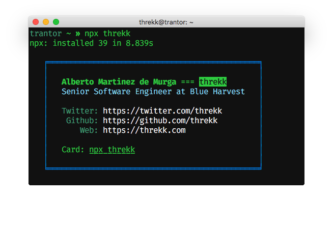

# NPM
<!-- badge -->
[](https://github.com/threkk/npm-card/issues)
[](https://www.npmjs.com/package/threkk)
[](https://www.npmjs.com/package/threkk)
[](https://twitter.com/intent/tweet?text=Wow:&url=https%3A%2F%2Fgithub.com%2Fthrekk%2Fmyip)
<!-- endbadge -->
> NPM business card.



## Usage
```
npx threkk 
```

## Maintainer
Alberto Mtnz ([@threkk](https://threkk.com))

## Contribute
Did you find any problem? Please, check the [issues](https://github.com/threkk/myip/issues?q=is%3Aissue+is%3Aopen+sort%3Aupdated-desc)!

## License
BSD-3. See `LICENSE` for more information.
